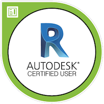

# Welcome to Grekin Studios!

My name is Greg King and I am a Technology Education teacher at Hamburg Area High School, in Hamburg Pa.  I maintain this page to track and present my current and past projects.

  
## Certifications

  

### Codecademy Certificates

[Learn C#](https://www.codecademy.com/profiles/thegrekin/certificates/65f0ff88f4fc58e0536b3b51648dff24) | [Learn Javascript](https://www.codecademy.com/profiles/thegrekin/certificates/705dcb15de0da4dd9d9fc4f3274b430e) | [Learn HTML](https://www.codecademy.com/profiles/thegrekin/certificates/9eb0741e5ebef1f9f58a53bfac67d3a7) | [Learn CSS](https://www.codecademy.com/profiles/thegrekin/certificates/9a5bb1fc45b4281af1fffec93b0aaf05) | [Learn Node.js](https://www.codecademy.com/profiles/thegrekin/certificates/240305d50b925c17868f1ac7a21a3261) 

### Microsoft Learn Profile
[Greg King @ Microsoft Learn](https://docs.microsoft.com/en-us/users/gregking-4734/)

## Web Design and Javascript

[Dice Breaker](http://www.grekinstudios.com/dice_breaker_online)

*This was a website a created with basic HTML, CSS, and Javascript to support a roleplaying game I was running for my students. Being able to roll any amount of dice with a number of RPG-friendly options while working remotely was very useful for us (it can roll nearly a billion dice!).*

[Luft Duck](https://www.grekinstudios.com/luft_duck/)

*I get chronic migraines, which are triggered by barometric pressure changes.  I have never found a site or app that shows those changes the way I wanted to see them, so I decided to create my own!  This project was create using intermediate HTML, CSS, and Javascript as I was learning in my courses on Codecademy.  I specifically wanted to learn how to do API calls and how to display data well. --Note: This application was previously published under a different name, but I shared it on a forum and it received so much attention that I was locked out of my APIs for a time. I have since changed the name and made the repository private (the name comes from the German "Luftdruck" which means simply "Barometric Pressure."*

## Other Github Projects

[Dice Breaker Discord Bot](https://github.com/MrKing-dev/dice-breaker)

*This is the original version of my "Dice Breaker" design, intended to be used via Discord.*

[Dice Core (C#)](https://github.com/MrKing-dev/Dice_Core_CSharp)

*This is a refactoring of my Dice Breaker site, done in C# in preparation for learning Blazor Webassembly*

## Other Coding Projects

*Coming Soon!*

## Grekin Studios on the Google Play Store

[Grekin Studios Android Applications](https://play.google.com/store/apps/dev?id=7281819562685950623)

## 3D Modeling Projects>

*Coming soon*

### Contact

[support@grekinstudios.com](mailto:support@grekinstudios.com)
